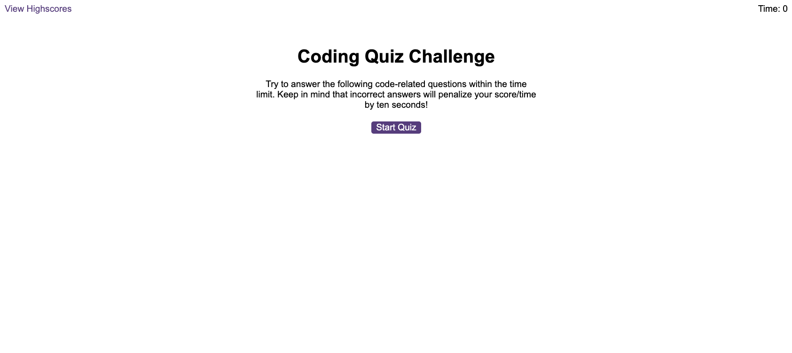

# JavaScript Quiz Application

## Objective
Build an interactive web-based quiz on JavaScript fundamentals, featuring a timed format and the ability to store high scores.

## Goal
Create an engaging quiz application for users to test their knowledge of JavaScript. The quiz includes multiple-choice questions, a countdown timer, and penalties for incorrect answers. Users can save their scores along with their initials to a leaderboard using local storage.

## Preview

## Deployment
[Visit the Live Application](https://calebtkjordan.github.io/code-quiz/)
